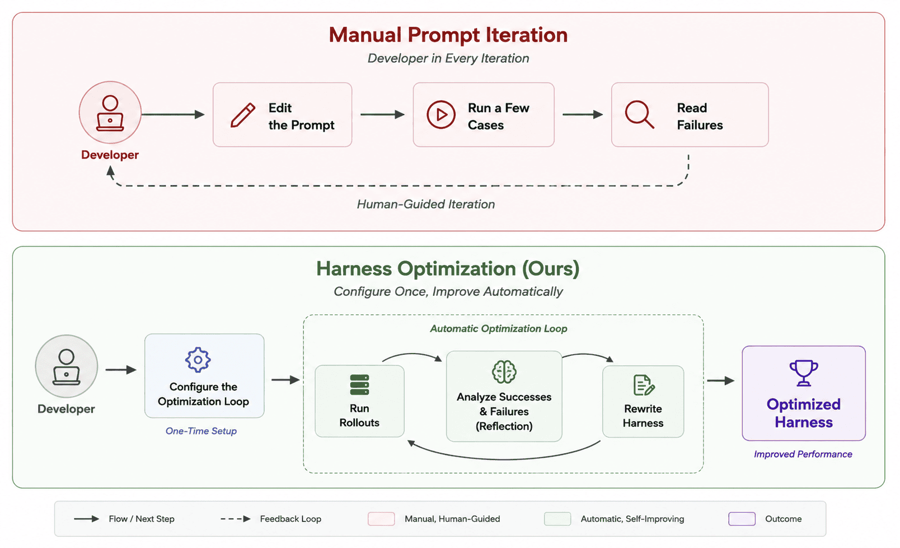
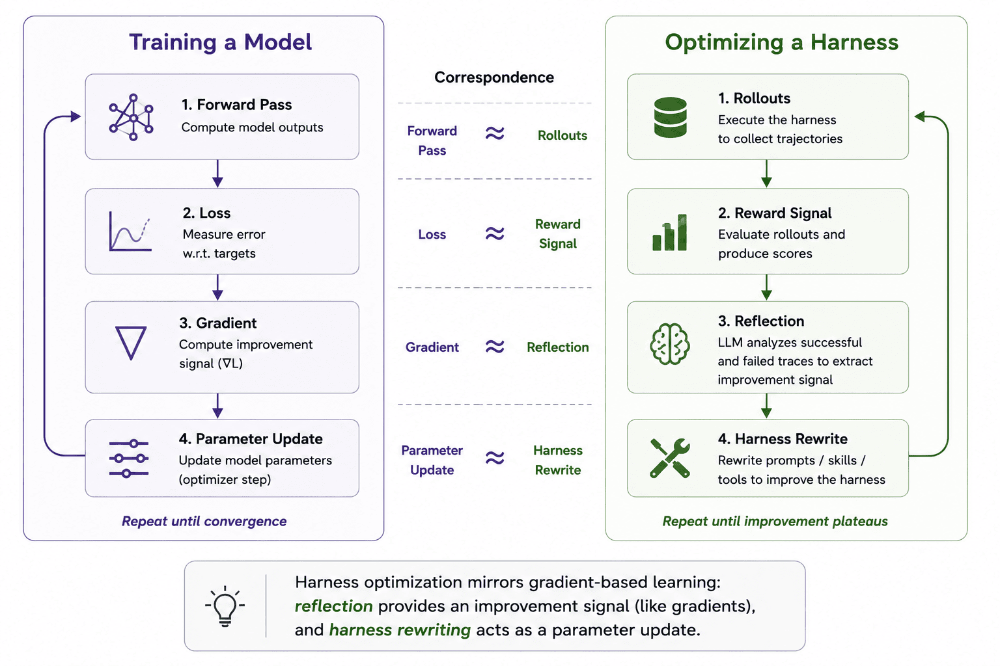
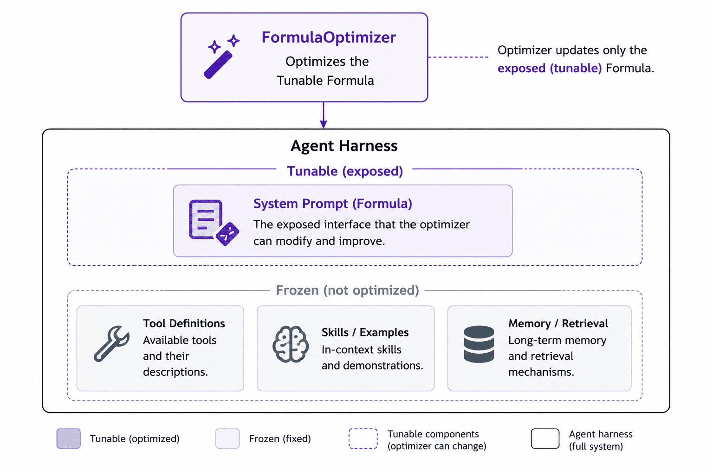
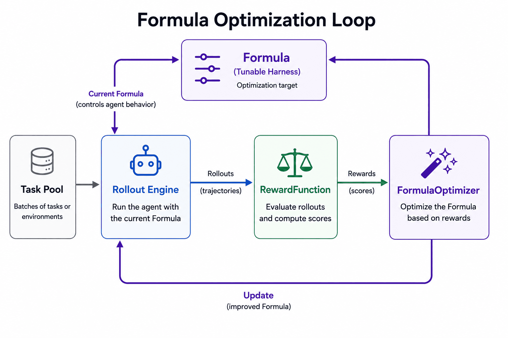
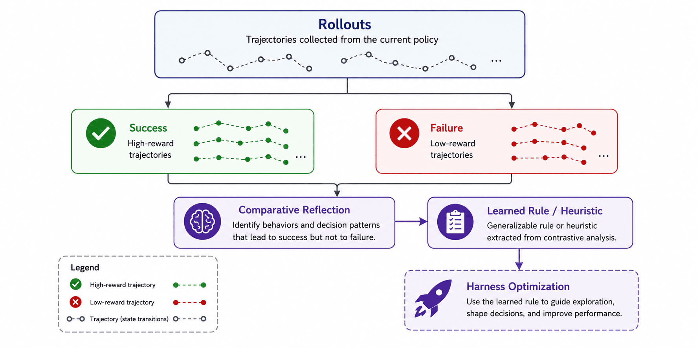
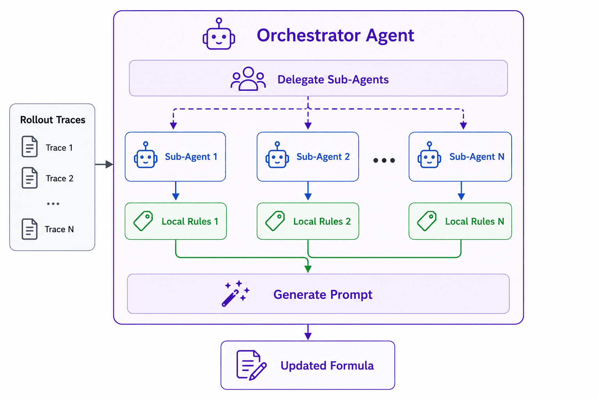
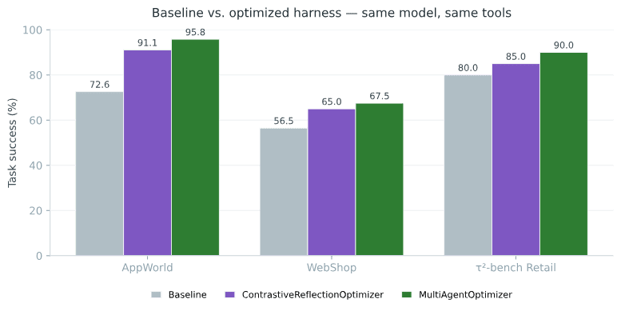

> **TL;DR:** [Harness Optimizer](https://github.com/strands-labs/harness-optimizer) (`pip install strands-harness-optimizer`) is an open-source library that optimizes the context around your LLM agent (system prompt, tool docs, skills) the way you'd train a model: rollouts in, rewards out, parameters updated. In our benchmark runs it lifted task success from **72.6% to 95.8% on AppWorld** and **56.5% to 67.5% on WebShop**, using the same loop you'd run yourself. Customers can also test our methods on [AgentCore Optimization on AWS](https://docs.aws.amazon.com/bedrock-agentcore/latest/devguide/optimization.html) with minimal setup for using production traces for continuous improvement.

Getting an LLM agent to work well is hard. The model is good, but it needs the right configuration and scaffolding around it. Call that the *harness*. Today you tune the harness by hand: tweak the system prompt, run a few cases, eyeball the failures, tweak again.

That harness is everything you wrap around the model to get useful behavior: the system prompt, tool definitions, skills, retrieved context. A sharper tool description, for instance, can lead to more accurate tool invocation. But hand-tuning doesn't scale: it improves only when a human notices a failure pattern, and it falls apart across the tasks your agent sees, let alone production agents with more diverse tasks and varied end users.



We built [Harness Optimizer](https://github.com/strands-labs/harness-optimizer): treat the harness as something you **optimize**, not something you author. It's open source under Apache 2.0.

## The mental model: harness as parameters

We introduce the **Formula**: a tunable component of the harness, e.g., the system prompt, a set of skills, or a tool definition. Each Formula parameterizes the harness component and pairs with an optimizer that improves it.

In an automatic loop, the Formula runs steps that are similar to training models: forward pass → loss → gradient → optimizer step → repeat. Harness Optimizer borrows that shape exactly, but the "parameters" are your Formulas, and the optimizer isn't just numeric search. It could be an LLM agent that reads your agent's traces and rewrites the Formulas.



In Harness Optimizer, we have four major classes for forming the optimization loop, i.e., [**Formula**](https://github.com/strands-labs/harness-optimizer/blob/main/strands_harness_optimizer/formulas/formula.py), [**RewardFunction**](https://github.com/strands-labs/harness-optimizer/blob/main/strands_harness_optimizer/rewards/reward_function.py), [**FormulaOptimizer**](https://github.com/strands-labs/harness-optimizer/blob/main/strands_harness_optimizer/optimizers/optimizer.py) (`.step()`), and [**Trainer**](https://github.com/strands-labs/harness-optimizer/blob/main/strands_harness_optimizer/trainer.py).

1. **Formula** is the recipe of editing a harness component, e.g., system prompt;
2. **RewardFunction** evaluates the agent trace;
3. **FormulaOptimizer** optimizes the Formula with RewardFunction;
4. **Trainer** loads the data, runs the agent rollouts, and calls FormulaOptimizer to update Formula's parameters;

The FormulaOptimizer only touches what your Formula exposes. More Formulas can be attached to the FormulaOptimizer to automatically optimize more components of your harness.



Every Formula exposes the same small interface: read the current params, write new ones back, and process with the agent:

```python
class Formula(ABC):
    def process(self, context: dict, **kwargs) -> dict: ...   # apply to a request
    def get_tunable_params(self) -> dict: ...                 # read params out
    def update_params(self, params: dict) -> None: ...        # write new params in
```

You attach Formulas to an agent through an adapter. For [Strands](https://strandsagents.com) agents that's one call:

```python
from strands import Agent
from strands_harness_optimizer.formulas import SystemPromptFormula
from strands_harness_optimizer.adapters import apply_formulas_on_strands_agent

formula = SystemPromptFormula(system_prompt="You are a helpful assistant.")

agent = Agent(model=model)
apply_formulas_on_strands_agent(agent, [formula])
```

We can attach the Formula to any Strands agent and assemble the full optimization loop with: a **DataLoader** which loads and processes the dataset, an **AgentRolloutEngine** which executes the agents and produces the rollouts, a **RewardFunction** which scores each rollout, and the **FormulaOptimizer** turns those scores into new params, which flow back into the Formula for the next pass.



The Formula is the one thing the loop rewrites, the `update_params` edge that closes the cycle.

## Inside the optimizer: contrastive reflection

In the default [`ContrastiveReflectionOptimizer`](https://github.com/strands-labs/harness-optimizer/blob/main/strands_harness_optimizer/optimizers/system_prompt/contrastive_reflection.py), the optimization step is *itself an LLM agent*. It splits the rollouts into wins and losses by reward, reads them contrastively to find what the wins did that the losses didn't, and rewrites the Formula to encode it.



By default it *appends* what it learns rather than rewriting the prompt wholesale. Here's the kind of edit it makes, starting from a generic harness:

```text
You are an agent that completes tasks using the available APIs.
```

After a few epochs reading where the agent got stuck, it appends the patterns that separated wins from losses:

```text
You are an agent that completes tasks using the available APIs.

Learned from prior attempts:
- Call show_api_doc before invoking an API you haven't used — guessing
  argument names was the most common cause of failed runs.
- Phone numbers and dates must match the exact format the API returns;
  reformat values you pass back in.
- When a search returns nothing, broaden the query once before giving up
  rather than reporting "not found".
```

Nobody hand-wrote those rules. The reflection agent extracted them from the traces.

## Scaling the reflection with the multi-agent optimizer

A single reflection pass tends to fixate on whatever failure dominates the first few traces it reads and misses modes that surface in only a handful. Rather than hard-coding how to split the work, [`MultiAgentOptimizer`](https://github.com/strands-labs/harness-optimizer/blob/main/strands_harness_optimizer/optimizers/system_prompt/multi_agent.py) lets the main reflector spawn **sub-agents on demand**, each exploring a different slice of the trace set.

Each sub-agent analyzes one trace in its own context and returns the trace-specific findings for the prompt. The orchestrator never reads raw traces; it just generalizes, deduplicates, and condenses those findings into the prompt edit.



## A full loop, end to end

We can wire the Formula and Optimizer up given a rollout engine (in the code snippet, we use the [`LocalRolloutEngine`](https://github.com/strands-labs/harness-optimizer/blob/main/strands_harness_optimizer/rollout_engines/local_engine.py) running on the local server), which generates the agent rollouts with the Formula to run the optimization with `trainer.fit()` as:

```python
from strands import Agent
from strands_harness_optimizer import LocalRolloutEngine, Trainer
from strands_harness_optimizer.formulas import SystemPromptFormula
from strands_harness_optimizer.optimizers import ContrastiveReflectionOptimizer

def agent_create() -> Agent:
    # The user's custom agent factory function
    return Agent()

def agent_invoke(agent, data):
    # The user's custom agent invocation function
    return agent(data)

formula    = SystemPromptFormula("Solve the problem step by step.")
engine     = LocalRolloutEngine(formula, agent_create=agent_create,
    agent_invoke=agent_invoke)
optimizer  = ContrastiveReflectionOptimizer(formula, ...templates...)
trainer    = Trainer(formula, optimizer, reward_fn, engine, dataloader, n_epochs=2)

trainer.fit()                              # runs the loop
formula.get_tunable_params()["system_prompt"]   # the evolved prompt
```

The full runnable version, imports, templates, GSM8K loading, and a held-out eval, is in [`examples/gsm8k_trainer.py`](https://github.com/strands-labs/harness-optimizer/blob/main/examples/gsm8k_trainer.py). The example starts with a one-line prompt and the optimizer can optimize the system prompt into a functioning system prompt for the dataset.

## Results on agentic benchmarks

We ran the same loop on three hard, multi-step benchmarks, [AppWorld](https://appworld.dev/), [WebShop](https://webshop-pnlp.github.io/), and [tau-bench](https://github.com/sierra-research/tau-bench), with a Claude Sonnet 4.6 agent, optimizing only the system prompt:



The Harness Optimizer improves the model performance on AppWorld by **+23 points** (72.6 → 95.8).

Both optimizers improve every benchmark over baseline, and the multi-agent optimizer comes out ahead. Same code path, no per-benchmark tuning.

## When to use it

Harness Optimizer is a good fit when:

- You have a reward signal to separate good from bad, whether a programmatic check or an LLM judge, e.g., [AgentCore Evaluations](https://docs.aws.amazon.com/bedrock-agentcore/latest/devguide/evaluations.html) and [Strands Evals](https://github.com/strands-agents/evals).
- Trajectories are long and the reward is diffuse. Reading the whole trace recovers signal that the real cause can be revealed from the long trajectory.
- A new task carries rules the base prompt never mentioned. The optimizer surfaces them from real attempts.

## What's next

We aim to add more formulas for optimizing the **skills, memory, and tools** that are the harness components shaping agent behavior through the same interface. We are actively working on:

- Skill Formulas will tune which exemplars and procedures the agent gets, and how they're phrased.
- Memory Formulas will optimize what's written to and retrieved from long-term memory.
- Tool Formulas will evolve tool descriptions and signatures.

New Formulas drop straight into the existing Trainer without changes. If you have ideas for formulas that optimize different parts of the harness, or optimizers tuned for specific scenarios, we want to see them.

## Try it

```bash
pip install strands-harness-optimizer
```

- Repo: [github.com/strands-labs/harness-optimizer](https://github.com/strands-labs/harness-optimizer). Star it, file issues, open a PR.
- Docs: the user guide walks through [Formulas](https://github.com/strands-labs/harness-optimizer#formula-formulas), [Adapters](https://github.com/strands-labs/harness-optimizer#strands-adapter-adapters), [Rewards](https://github.com/strands-labs/harness-optimizer#rewardfunction-rewards), [Optimizers](https://github.com/strands-labs/harness-optimizer#formulaoptimizer-optimizers), and the [rollout engines](https://github.com/strands-labs/harness-optimizer#agentrolloutengine-rollout_engines).
- Example: [`examples/gsm8k_trainer.py`](https://github.com/strands-labs/harness-optimizer/blob/main/examples/gsm8k_trainer.py) runs the whole loop on real math problems.
- AgentCore Optimization: Customers can also use our [AgentCore Optimization](https://docs.aws.amazon.com/bedrock-agentcore/latest/devguide/optimization.html) service on AWS for automatic agent optimization based on real production traces.

The harness is where most of your agent's behavior lives. Stop tuning it by hand, start training it. Contributions of new Formulas (tool docs, skills, retrieval), optimizers, and adapters are welcome. Join the Strands community at [discord.gg/strands](https://discord.gg/strands).
